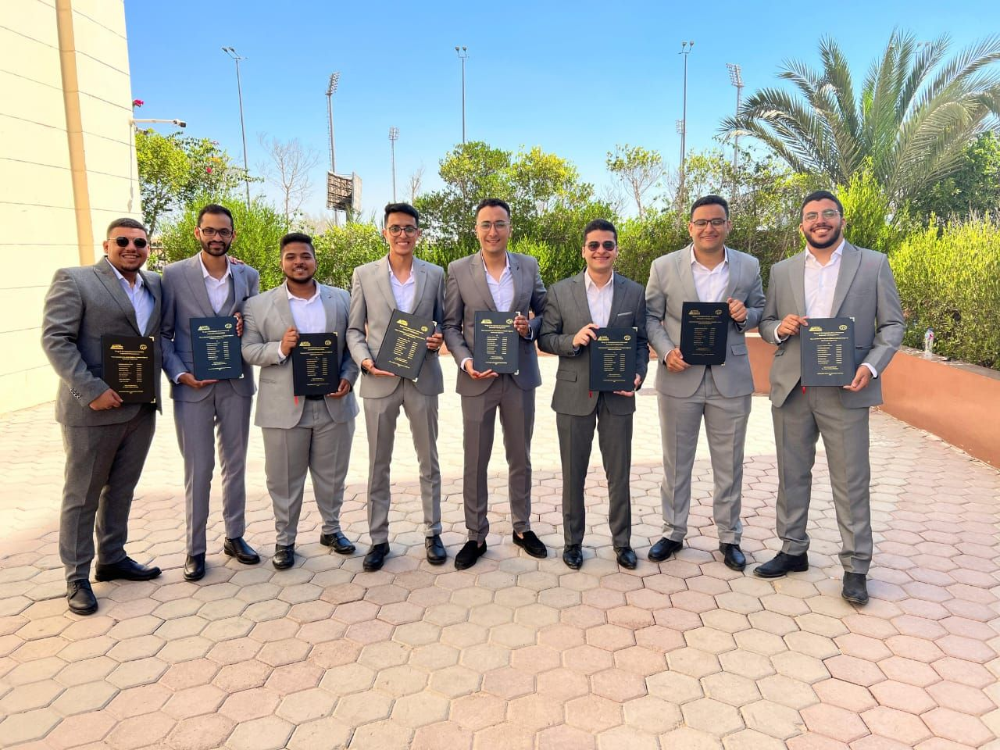

---
# 🚗 Autonomous Automotive Parking System

### Graduation Project – Mechatronics Engineering – 2024

## 📌 Overview

This project presents the design and development of an **autonomous self-parking system** capable of detecting suitable parking spaces, selecting the appropriate parking type (parallel or perpendicular), and executing the parking and exit maneuvers automatically. It integrates **Advanced Driver Assistance Systems (ADAS)** concepts to enhance safety, reduce human error, and improve parking efficiency in tight urban environments.

---

## 🎯 Objectives

* Design and implement a self-parking car prototype.
* Detect available parking slots using ultrasonic sensors.
* Identify and differentiate between **parallel** and **perpendicular** parking.
* Plan and execute the **shortest collision-free path** to park the car autonomously.
* Test the system under real-world conditions.

---

## 🧠 Features

* Automatic detection of parking spaces.
* Smart decision-making for choosing parking strategy.
* Smooth and safe maneuvering using **non-holonomic kinematic constraints**.
* Real-time obstacle detection and avoidance.
* Full software architecture including **MCAL**, **HAL**, and **Application Layer**.
* Real-time scheduling using **RTOS**.
* MATLAB-based simulation and validation.

---

## 🛠️ Technologies & Components

### Hardware:

* STM32F103C8T6 (Bluepill)
* Ultrasonic Sensors × 4
* DC Motors × 2
* Servo Motor × 1
* L298N Motor Driver
* Lithium Batteries, BMS, Voltage Regulators
* Custom-designed chassis and steering mechanism (inspired by BMW car dimensions)

### Software:

* Low-level drivers (MCAL): GPIO, RCC, EXTI, Timer, UART, I2C
* Hardware Abstraction Layer (HAL) for motor and sensor control
* Application Layer with custom path planning and control logic
* Real-Time Operating System (RTOS) for task scheduling
* Path planning algorithms implemented & tested in MATLAB

---

## 🧭 Path Planning Strategy

Implemented two main algorithms:

* **Parallel Parking**: CSC (Circle-Straight-Circle) path planning
* **Perpendicular Parking**: CS (Circle-Straight) path planning

Each parking scenario includes:

* Obstacle detection
* Space validation
* Shortest path generation
* Collision avoidance verification

---

## 🧪 Testing & Results

* Simulations verified using MATLAB for both parking types.
* Real-world tests showed **accurate space detection** and **successful autonomous parking** in predefined spaces.
* Limitations like tight turning radius or dynamic obstacles noted as future development targets.

---

## 📈 Cost Breakdown

| Component                | Quantity | Cost (EGP) |
| ------------------------ | -------- | ---------- |
| Blue Pill Board          | 1        | 450        |
| Ultrasonic Sensors       | 4        | 170        |
| DC Motors                | 2        | 760        |
| Servo Motor              | 1        | 200        |
| Others (Power, Chassis…) | -        | 2295       |
| **Total**                | -        | **3875**   |

---

## 🔮 Future Work

* Implementing dynamic environment handling (moving obstacles).
* Enhancing path planning with AI (e.g., Reinforcement Learning).
* Adding camera-based visual SLAM for environment mapping.
* Integration with mobile app for remote control and monitoring.

---

## 📸 Gallery

---

## 👨‍💻 Contributors

* Omar Ehab El-Sayed
* Abdelrahman Abd-Elmoez
* Abdelrahman Emad
* Ayman Hamdy
* Daniel George
* Kareem Abdelkader
* Peter Sameh
* Shehab Gomaa
* Youssef Yacoub

**Supervisor:** Dr. Ahmed Abdelaziz Mohamed

---
